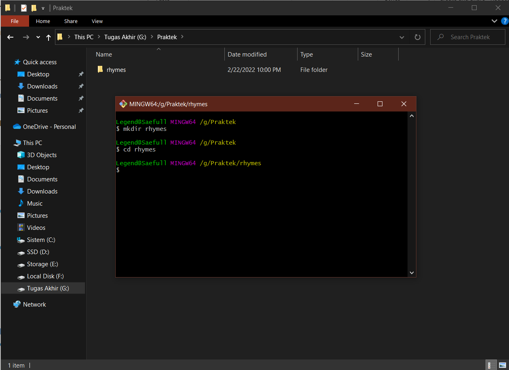
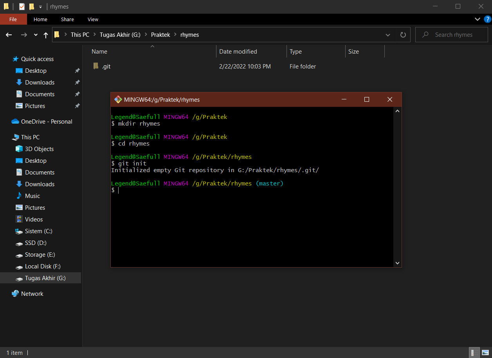
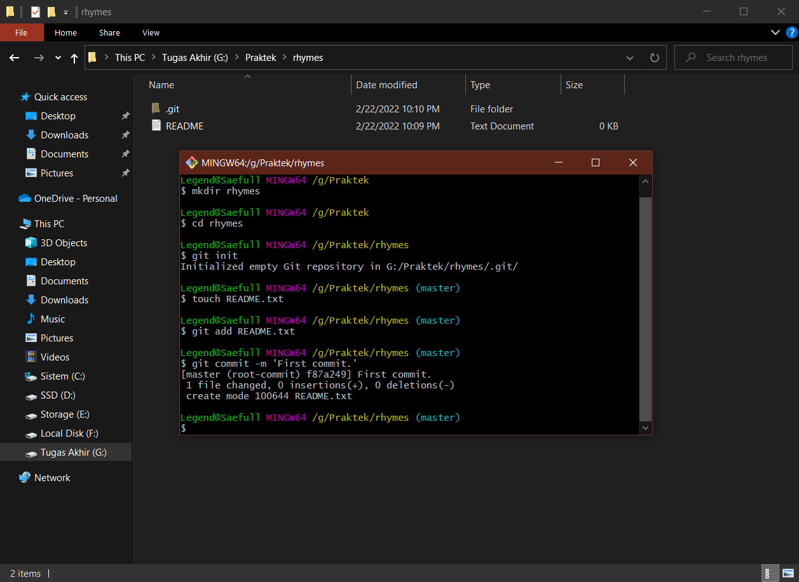
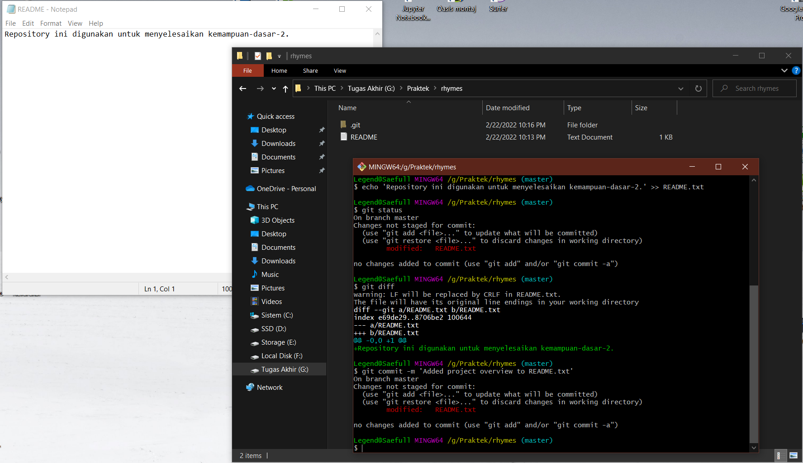
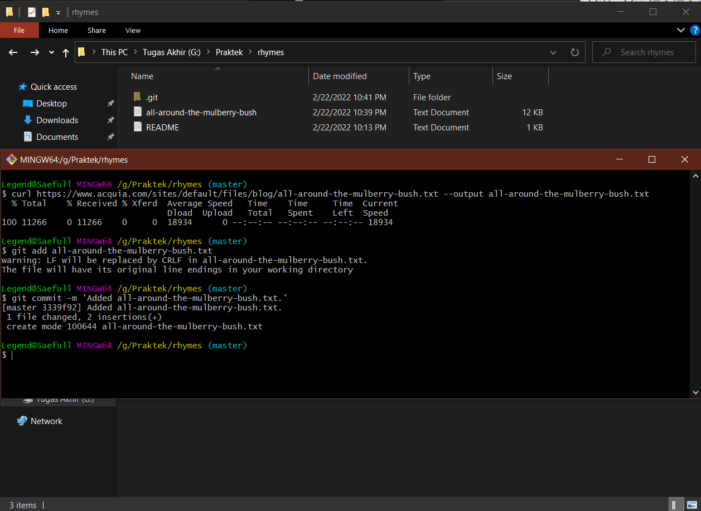
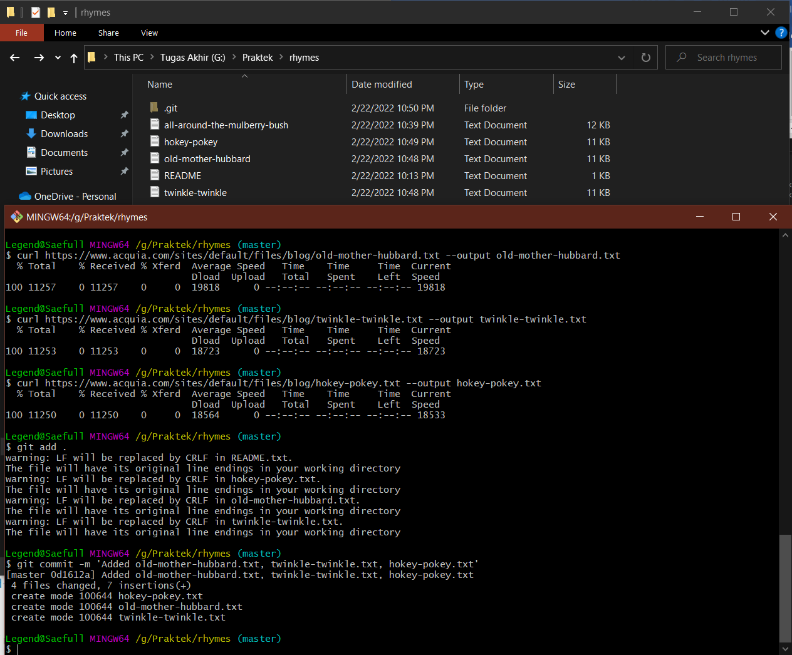
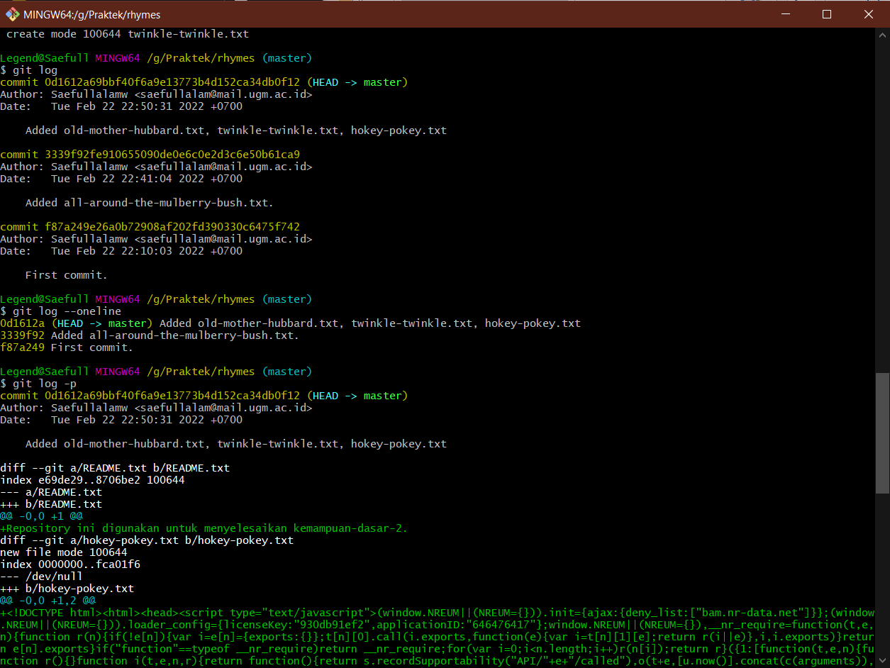
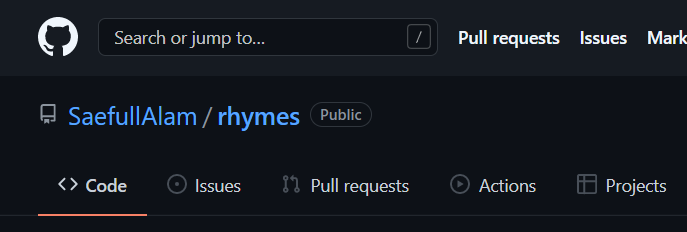
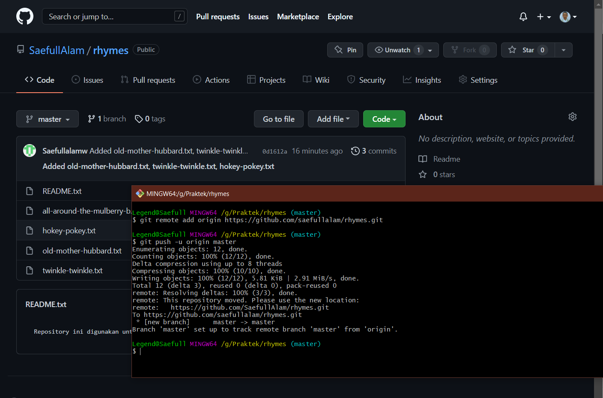

# Dokumentasi Step by Step Praktik-1

'Menjalankan GitBash lalu membuat folder bernama rhymes dan masuk ke dalamnya'

'Membuat repository Git kosong di dalam direktori rhymes'

'Membuat file kosong README.txt'

'Menambahkan penjelasan mengenai project ke dalam file README serta melakukan review hingga pada akhirnya dicommit.'

'Mengunduh file dari situs dan memasukkan ke dalam file txt, lalu dicommit ke dalam repository'

'Mendownload 3 file secara bergantian kemudian menambahkan dan melakukan commit secara massal'

'Mereview dan melihat commit history'

'Membuat repo “rhymes” pada GitHub'

'Menyimpan repo lokal Git ke dalam repository GitHub'

