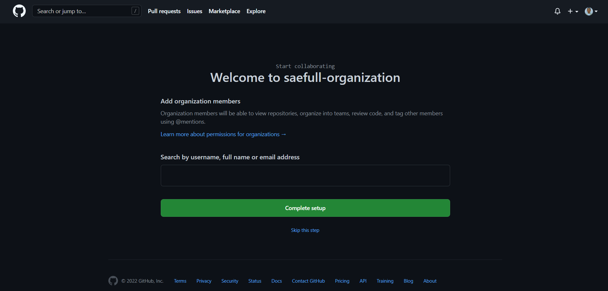
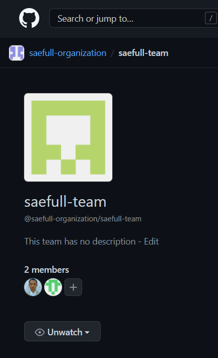

Membuat organisasi pada GitHub

Membuat sebuah tim di dalam organisasi

Mengundang orang lain untuk bergabung ke dalam organisasi

Mengatur akses repository member dalam tim

Menambahkan tim pada kolaborator

Menghubungkan Git dan GitHub serta membuat push dan pull request.

Dimulai dari membuat file index.html dan style.css

Mengupload repo lokal ke repo GitHub

Melakukan fork, membuat branch baru, mengedit file pada akun GitHub lain

Melakukan pull request pada branch baru

Menerima pull request

Merging pull request

