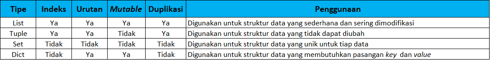

# Latihan

## Struktur Data
Python mendukung beberapa tipe struktur data yang digunakan untuk menyimpan dan mengorganisasi data sebuah program. Struktur data yang didukung Python secara <i>built-in</i> seperti List, Dictionary, Tuple, dan Set. Selain itu ada banyak jenis struktur data yang dapat didefinisikan sendiri oleh pengguna seperti Stack, Queue, Tree, Linked List, Graph, dan Hash Map. Masing masing tipe struktur data memiliki karakteristik berupa kelebihan dan kekurangan sehingga penggunaannya disesuaikan dengan kebutuhan program. Karakteristik masing masing struktur data ditunjukkan oleh tabel 1



# Kode
```python
buah = ['Anggur', 'Apel', 'Jeruk']
buah.sort()
buah.append('Leci')
buah.remove('Anggur')
buah.index('Apel')
buah2 = buah.copy()
buah2.count()
buah2.reverse()
```
## Penanganan Error (Error Handling)

Interpreter Python bekerja dengan menerjemahkan kode satu persatu untuk setiap baris dari baris teratas hingga baris terbawah secara urut. Akibatnya ketika terjadi kesalahan di suatu baris, baris selanjutnya tidak akan dieksekusi. Penanganan Error diperlukan untuk program yang menyertakan fungsi masukan bagi pengguna. Hal tersebut disebabkan karena masukan pengguna terkadang tidak sesuai dengan tipe data yang telah ditentukan pada program sehingga dapat menyebabkan error. Program yang dibangun tanpa penanganan error akan otomatis berhenti apabila terjadi error. Agar program dapat tetap berjalan walaupun terjadi error, diperlukan adanya penanganan sesuai dengan jenis jenis error yang terjadi. Jenis jenis error yang dapat muncul pada Python yaitu SyntaxError, ZeroDivisionError, NameError,TypeError, dll

## Kode

```python
while True:
    try:
        x = int(input("Input a number: "))
        break
    except ValueError:
        print("Input salah. Mohon masukkan nomor")
```


# Kasus
Kasus kali ini menggabungkan materi struktur data (list),algoritma sorting(bubble sort), Modules (class & function), Input dan Output (string formatting), error handling (try & except)

```python
class sorting:
    def __init__(self,data):
        self.data = data

    def bubble_sort(self):
        try:
            n = len(self.data)
            array = self.data
            for i in range(n):
                already_sorted = True
                for j in range(n - i - 1):
                    if array[j] > array[j + 1]:
                        array[j], array[j + 1] = array[j + 1], array[j]
                        already_sorted = False
                if already_sorted:
                    break
            return array
        
        except:
            print("Data bukan tipe list!")
            return None

    def panjang_list(self):
        try:
            print(f'Panjang data : {len(self.data)}')
        except:
            print("Data bukan tipe list!")
            return None
```