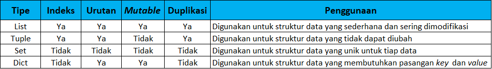

#Latihan

##Struktur Data
Python mendukung beberapa tipe struktur data yang digunakan untuk menyimpan dan mengorganisasi data sebuah program. Struktur data yang didukung Python secara <i>built-in</i> seperti List, Dictionary, Tuple, dan Set. Selain itu ada banyak jenis struktur data yang dapat didefinisikan sendiri oleh pengguna seperti Stack, Queue, Tree, Linked List, Graph, dan Hash Map. Masing masing tipe struktur data memiliki karakteristik berupa kelebihan dan kekurangan sehingga penggunaannya disesuaikan dengan kebutuhan program. Karakteristik masing masing struktur data ditunjukkan oleh tabel 1



# Kode
```python
buah = ['Anggur', 'Apel', 'Jeruk']
buah.sort()
buah.append('Leci')
buah.remove('Anggur')
buah.index('Apel')
buah2 = buah.copy()
buah2.count()
buah2.reverse()
```


#Kasus
Kasus kali ini menggabungkan materi struktur data (list), Modules (class & function), Input dan Output (string formatting), error handling (try & except)

```python
class sorting:
    def __init__(self,data):
        self.data = data
    def sort_asc(self):    
        sort_res = self.data
        try:
            sort_res.sort(reverse=False)
        except:
            print("Data bukan tipe list!")
            return None
        return sort_res
    def sort_desc(self):
        sort_res = self.data
        try:
            sort_res.sort(reverse=True)
        except:
            print("Data bukan tipe list!")
            return None
    def panjang_list(self):
        try:
            print(f'Panjang data : {len(self.data)}')
        except:
            print("Data bukan tipe list!")
            return None
```